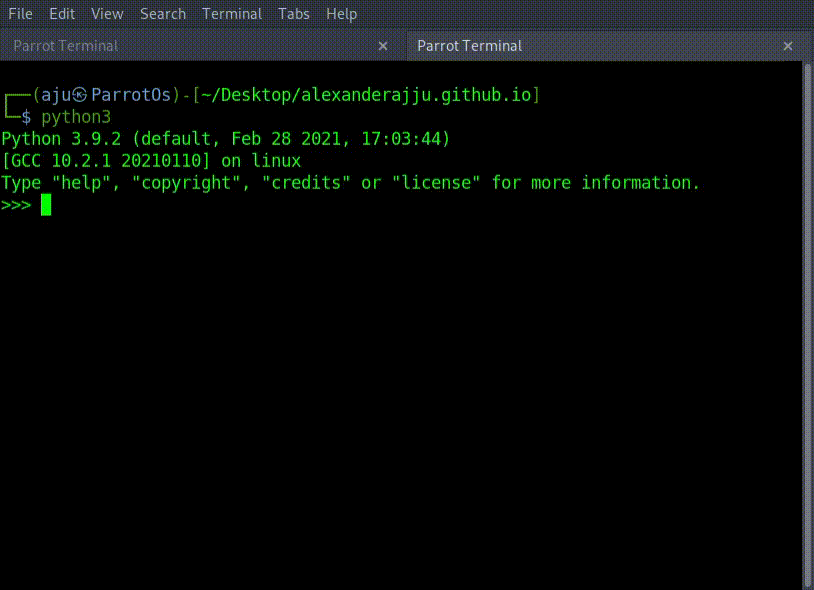
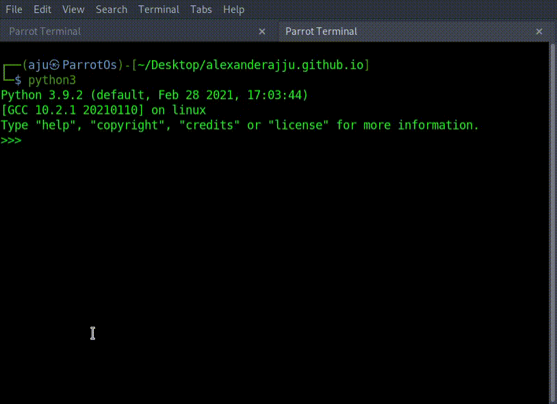

Python supports the usual logical conditions from mathematics:

- Equals: a == b
- Not Equals: a != b
- Less than: a < b
- Less than or equal to: a <= b
- Greater than: a > b
- Greater than or equal to: a >= b

These conditions can be used in different ways by loops and If statements. Implementation an if statement can be made using the keyword `if`

```python3
>>> a = 33
>>> b = 200
>>> if b > a:
...     print("b is greater than a")
...
b is greater than a
```



### Note

- Python relies on indentation (whitespace at the beginning of a line) to define scope in the code. Other programming languages often use curly-brackets for this purpose.
- You can have if statements inside if statements, this is called nested if statements.

```python3
if x > 10:
 print("Above ten,")
 if x > 20:
   print("and also above 20!")
 else:
   print("but not above 20.")
```

- if you for some reason have an `if` statement with no content, put in the pass statement to avoid getting an error.

```python3
a = 33
b = 200

if b > a:
  pass
```

- The `or` keyword is a logical operator, and is used to combine conditional statements:

```python3
a = 200
b = 33
c = 500
if a > b or a > c:
  print("At least one of the conditions is True")
```

- The `and` keyword is a logical operator, and is used to combine conditional statements:

```python3
a = 200
b = 33
c = 500
if a > b and c > a:
  print("Both conditions are True")
```

# Chained Conditionals

## Elif

The elif keyword is pythons way of saying "if the previous conditions were not true, then try this condition". You can multiple numbers of `elif` in `if` statement

```python3
a = 33
b = 33
if b > a:
  print("b is greater than a")
elif a == b:
  print("a and b are equal")
```

## Else

The else keyword catches anything which isn't caught by the preceding conditions.

```python3
a = 200
b = 33
if b > a:
  print("b is greater than a")
elif a == b:
  print("a and b are equal")
else:
  print("a is greater than b")
```

- You can also have an else without the elif:

## Ternary Operators

You can put it all on the same line, if you have only one statement to execute or one for if, and one for else



[Top](#)

[back](./contents.html)
