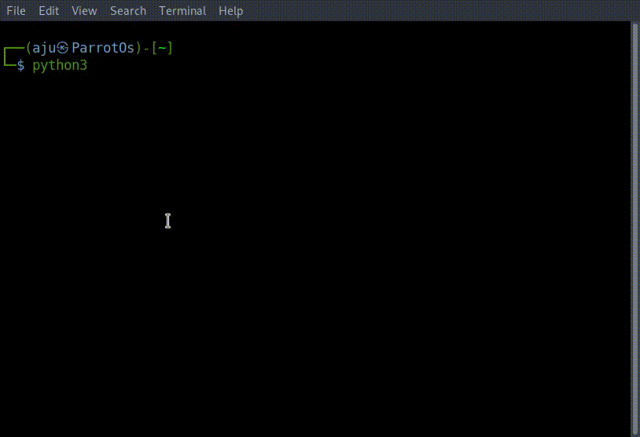

The python language is one of the most accessible programming languages available because it has simplified syntax and not complicated, which gives more emphasis on natural language. Due to its ease of learning and usage, python codes can be easily written and executed much faster than other programming languages.

# Installation

### Windows

The most stable [Windows](https://www.python.org/downloads/windows/) downloads are available from the Python for Windows page. On Windows you have a choice between 32-bit (labeled x86) and and 64-bit (labeled x86-64) versions, and several flavors of installer for each. The Python core team thinks there should be a default you don't have to stop and think about, so the yellow download button on the main download page gets you the "x86 executable installer" choice. This is actually a fine choice: you don't need the 64-bit version even if you have 64-bit Windows, the 32-bit Python will work just fine.

### Mac

See the [Python](https://www.python.org/downloads/mac-osx/) for Mac OS X page. MacOS from 10.2 (Jaguar) to 10.15 (Catalina) includes a system version of Python 2, but it is best not to consider this the Python to use for your programming tasks - install a current Python 3.x version instead. MacOS after 10.15 (Catalina) will not include a default system Python.

### Linux

For Red Hat, CentOS or Fedora, install the python3 and python3-devel packages.

For Debian or Ubuntu, install the python3.x and python3.x-dev packages.

For Gentoo, install the '=python-3.x\*' ebuild (you may have to unmask it first).

For other systems, or if you want to install from source, see the general download [page](http://www.python.org/download/)

### Hello world

```python3
┌──(aju㉿ParrotOs)-[~]
└─$ python3
Python 3.9.2 (default, Feb 28 2021, 17:03:44)
[GCC 10.2.1 20210110] on linux
Type "help", "copyright", "credits" or "license" for more information.
>>> print("Hello World!")
Hello World!
>>>

```


