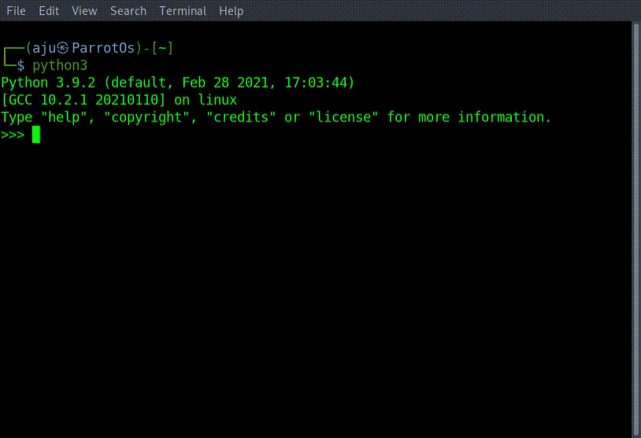

<a name="section_name"></a>
Variables are containers where the datas can be stored.
Variables declaration in **Python** doesn't require any particular type, and can even after they have been set.The equal sign (=) is used to assign a value to a variable.

### Basic Data Types in Python

- Integers.
- Floating-Point Numbers.
- Complex Numbers.
- Strings.
- Boolean

```python3
Python 3.9.2 (default, Feb 28 2021, 17:03:44)
[GCC 10.2.1 20210110] on linux
Type "help", "copyright", "credits" or "license" for more information.
>>> width = 20
>>> width
```

### Rules for Python variables:

- A variable name must start with a letter or the underscore character.
- A variable name cannot start with a number.
- A variable name can only contain alpha-numeric characters and underscores (A-z, 0-9, and \_ )
- Variable names are case-sensitive (age, Age and AGE are three different variables)

### Declarations of variables using types:

```python3
w = 1+2j      # w will be (1+2j)
x = str(3)    # x will be '3'
y = int(3)    # y will be 3
z = float(3)  # z will be 3.0

```

```python3
>>> a = True
>>> w = 1+2j
>>> x = 5
>>> y = "John"
>>> z = 6.6
>>> type(v)
<class 'bool'>
>>> type(w)
<class 'complex'>
>>> type(x)
<class 'int'>
>>> type(y)
<class 'str'>
>>> type(z)
<class 'float'>
>>>
```



[Top](#)

[back](./contents.html)
